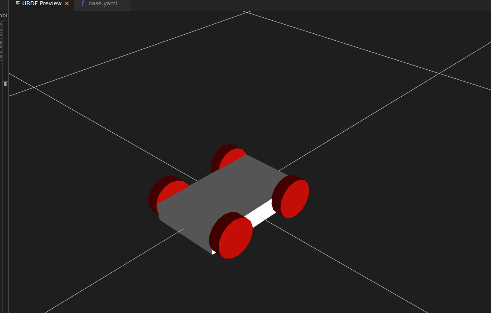
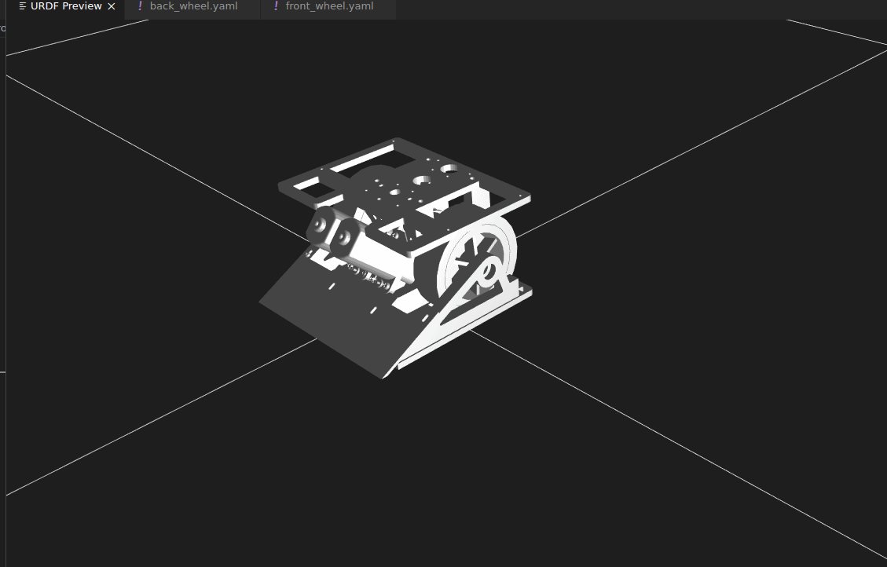

Version controlled source can is managed in this fork: [fjp/mobile_robot_description (diffbot branch)](https://github.com/fjp/mobile_robot_description/tree/diffbot)

# mobile_robot_description
ROS Package with a modular structure to create mobile robots with differential drive configuration. The purpose of this package is to provide xacro modules to make it easier to build the URDF description file of your differential robot. To active this purpose, this package has some modules that are inside the file ***common_macro.urdf.xacro*** that can be parametrized using YAML files, making it easier, fast, and more flexible to create your robot model.

  



- [Package Organization](#Package-Organization)
- [Installation](#Installation)
- [Usage](#Usage)
- [Contributing](#Contributing)

## Package Organization
This project has the following folder structure.

- **config:** Folder to place the config files with the parameters of the parts of the robot and also some config files to the RVIZ.
    - *sub-folder:* The config files to a specific project should be placed in a sub-folder in order to make it possible to have different models in the same project.
- **launch:** Folder with the launch files for the robots.
- **meshes:** Folder to place the mesh files for the links of the robot. These meshes files will be used **only** as visual. The collision of the links is set as basic shapes to reduce the computational cost as the Gazebo tutorial suggests.
    - *sub-folder:* The specific mesh files of each project should be placed in the sub-folder with the name of the project.
- **rviz:** Folder with the RVIZ configuration for the robot.
- **urdf:** Folder with the URDF and xacro files.
    - ***include:*** Folder with the common module files, similar to the Libs.

## Installation
To install this package, just clone it inside your ROS workspace, running:

``` 
$ git clone https://github.com/pxalcantara/mobile_robot_description.git 
```

## Usage 
The basic modules of this package are inside the file ***common_macro.urdf.xacro*** that is at *urdf/include* folder as described above. This file work as a library and you can add it to your robot description like [this](https://github.com/pxalcantara/mobile_robot_description/blob/48819dcec6f897b7d02e8d4aa6c66d803ddf6239/urdf/mobile_robot.urdf.xacro#L7):

```xml
<xacro:include filename="$(find ${package_name})/urdf/include/common_macros.urdf.xacro" />
```
⚠️ Note that in the command above, the `package_name` is set as a variable so to use this command you must have been set the package_name variable with the name of your project.

⚠️ **IMPORTANT! Before using the modules of the common_macro files, you MUST set a xacro property `package_name` with the name of your project and the xacro property `robot_name` with the name that you choose for your robot. This name should be the same as the folder where you organize the config and mesh files. It can be seen in the [mobile_robot](https://github.com/pxalcantara/mobile_robot_description/blob/48819dcec6f897b7d02e8d4aa6c66d803ddf6239/urdf/mobile_robot.urdf.xacro#L4), [quimera_robot](https://github.com/pxalcantara/mobile_robot_description/blob/48819dcec6f897b7d02e8d4aa6c66d803ddf6239/urdf/quimera_robot.urdf.xacro#L4) and [diffbot](https://github.com/pxalcantara/mobile_robot_description/blob/48819dcec6f897b7d02e8d4aa6c66d803ddf6239/urdf/diffbot.urdf.xacro#L4). In case of change the name of the package, as it is a template repository, the value of this variable MUST be updated with the name that you choose. Setting this property globally on the robot file makes the path for the config and mesh files correct, because it is made [relatively](https://github.com/pxalcantara/mobile_robot_description/blob/48819dcec6f897b7d02e8d4aa6c66d803ddf6239/urdf/include/common_macros.urdf.xacro#L76).**

In the ***common_macro.urdf.xacro***, there is the xacro modules:
- **[Color properties](https://github.com/pxalcantara/mobile_robot_description/blob/48819dcec6f897b7d02e8d4aa6c66d803ddf6239/urdf/include/common_macros.urdf.xacro#L278):** The color reference that appears on RVIZ.
- **Basic shape inertia:**
   - [sphere_inertia](https://github.com/pxalcantara/mobile_robot_description/blob/48819dcec6f897b7d02e8d4aa6c66d803ddf6239/urdf/include/common_macros.urdf.xacro#L264);
   - [box_inertia](https://github.com/pxalcantara/mobile_robot_description/blob/48819dcec6f897b7d02e8d4aa6c66d803ddf6239/urdf/include/common_macros.urdf.xacro#L255);
   - [cylinder_intertia](https://github.com/pxalcantara/mobile_robot_description/blob/48819dcec6f897b7d02e8d4aa6c66d803ddf6239/urdf/include/common_macros.urdf.xacro#L247);
   - [default_intertia](https://github.com/pxalcantara/mobile_robot_description/blob/48819dcec6f897b7d02e8d4aa6c66d803ddf6239/urdf/include/common_macros.urdf.xacro#L271);
- **[Base link](https://github.com/pxalcantara/mobile_robot_description/blob/48819dcec6f897b7d02e8d4aa6c66d803ddf6239/urdf/include/common_macros.urdf.xacro#L206):** A macro to add a base link that can be parametrized using YAML file. The `collision` of this link has a box shape and the `visual` can have a basic shape or use a mesh. 
- **[Wheel](https://github.com/pxalcantara/mobile_robot_description/blob/48819dcec6f897b7d02e8d4aa6c66d803ddf6239/urdf/include/common_macros.urdf.xacro#L9):** A macro to add the wheel link, joint and transmission. This macro can be parametrized using YAML file. The `collision` has the cylinder shape and the `visual` can have a basic cylinder shape or a mesh.
- **[Caster_wheel](https://github.com/pxalcantara/mobile_robot_description/blob/48819dcec6f897b7d02e8d4aa6c66d803ddf6239/urdf/include/common_macros.urdf.xacro#L58):** A macro to add a caster wheel link and joints. The caster_wheel only has passive joints, there is no `transmission` tag. This macro can be parametrized using YAML file. The `collision` has basic shapes and the `visual` can have a basic shapes or meshes. 

For more detailed information about the xacro modules or about the usage, see the [Wiki](https://github.com/pxalcantara/mobile_robot_description/wiki)

## Contributing
If you have any comments, doubts, or suggestions, I'll be more than happy to know them, so, feel free to open an issue or a Pull Request with your collaboration.

